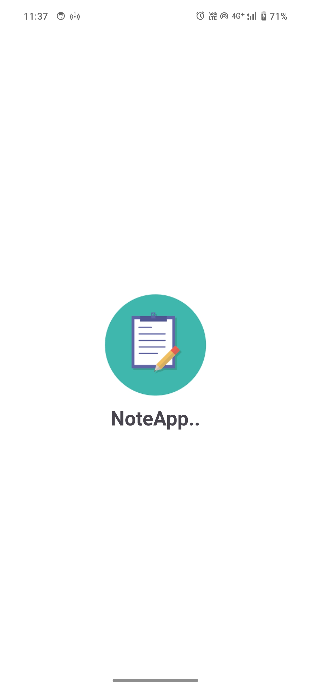
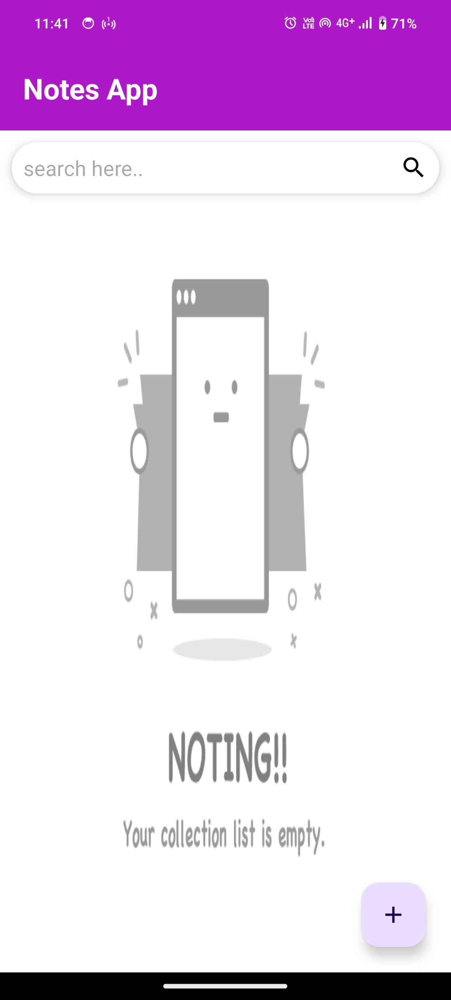
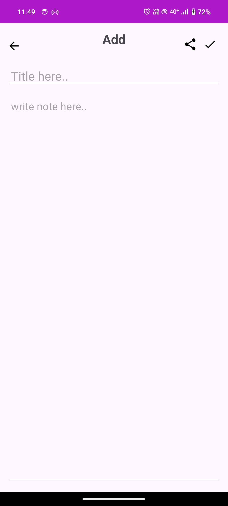
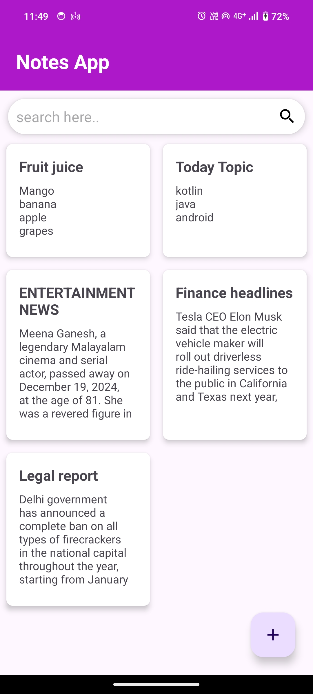
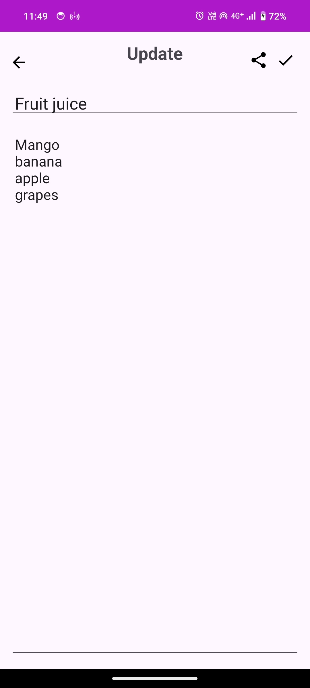
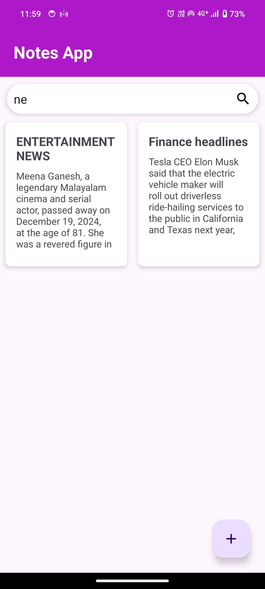
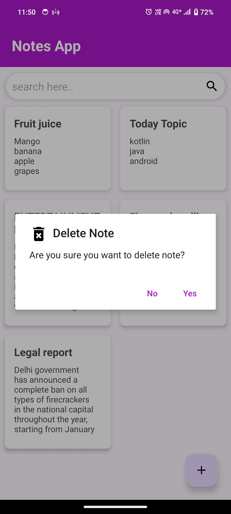

# NoteApp- Kotlin

NoteApp is a simple Android application built with Kotlin. It helps users manage their notes by providing basic CRUD functionality: creating, reading, updating, and deleting notes.
The app is designed with a clean and intuitive interface, making it easy to organize and store important information.

This project was created to demonstrate how to build an Android app using modern tools like Room for database management and the MVVM architecture for clean and maintainable code.

# Screenshot  
     
  

# Features:
1. Add new notes with a title and description.
2. View a list of all saved notes.
3. Edit existing notes easily.
4. Delete notes when no longer needed.
5. search note
5. Save data locally using Room, so your notes are always available offline.

